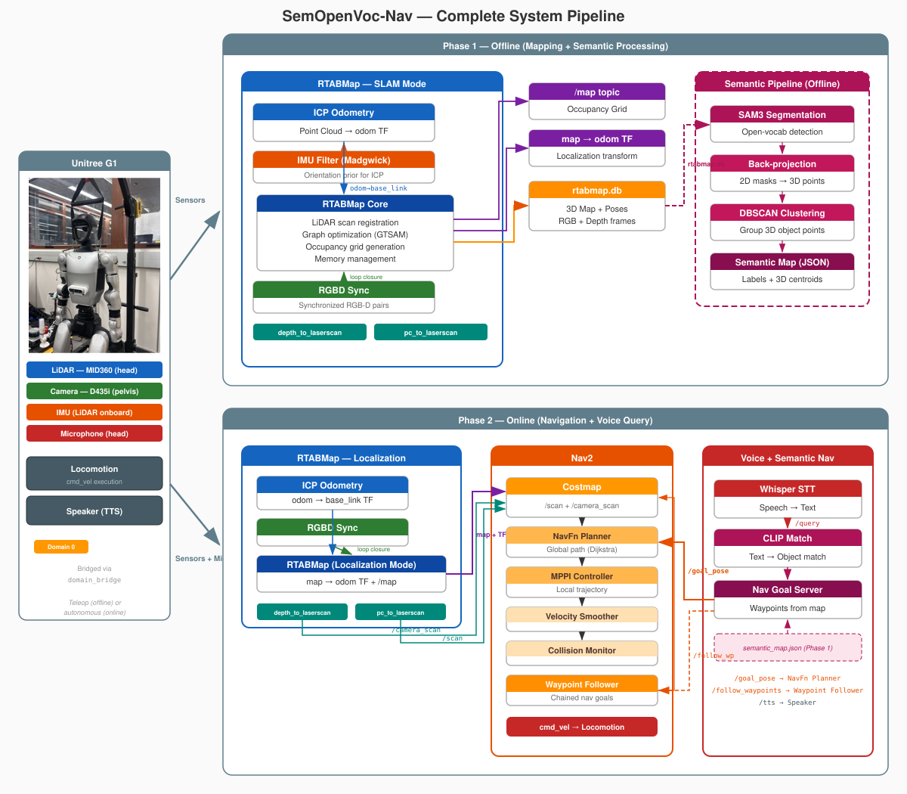
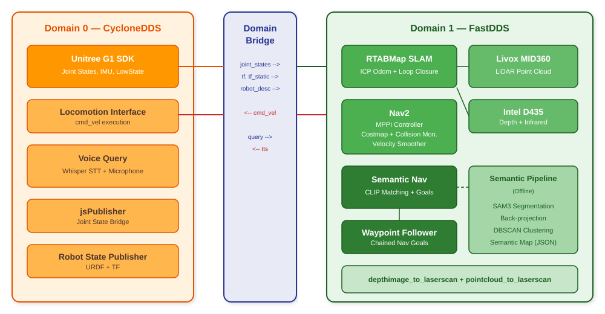
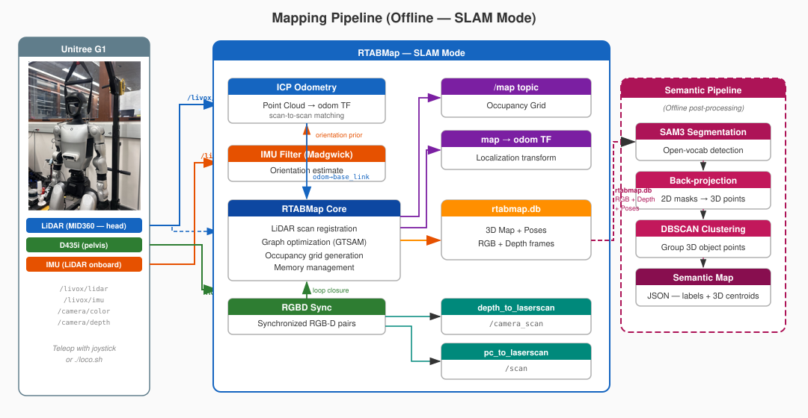
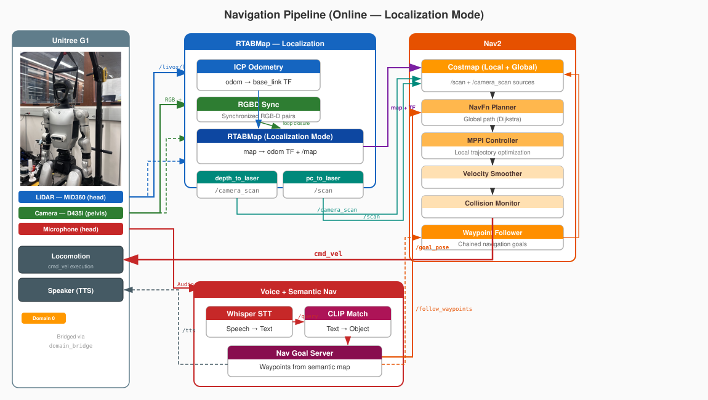

# SemOpenVoc-Nav

**Semantic Open-Vocabulary Navigation for Humanoid Robots**

[Read the portfolio post here](https://kjyothiswaroop.github.io/project/humanoid-exploration/)

**Author:** Jyothiswaroop Kasina

## Overview

Humans navigate indoor spaces not by following coordinates, but through a semantic understanding of their surroundings — walking toward "the fridge" or "the whiteboard" and communicating these intentions through natural language. SemOpenVoc-Nav brings this capability to a humanoid robot.

This project implements a semantic navigation pipeline on the **Unitree G1** that combines SLAM-based 3D mapping, open-vocabulary object detection (SAM + CLIP), and voice interaction (Whisper) — enabling the robot to navigate to objects described in natural language, such as *"check the fridge and then throw the trash away."*

<p align="center">
  
</p>

## Setup

### Prerequisites

Ubuntu 24.04, ROS 2 Kilted, Unitree G1 robot with D435 camera and Livox MID360 lidar.

Clone and follow the instructions from [unitree_ros2](https://github.com/kjyothiswaroop/unitree_ros2). Make sure to remove `source /opt/ros/kilted/setup.bash` from your `~/.bashrc` after setup.

### Install

```bash
mkdir -p ~/ws/winter/src && cd ~/ws/winter/src
git clone https://github.com/kjyothiswaroop/SemOpenVoc-Nav.git
cd SemOpenVoc-Nav
vcs import ../ < deps.repos
```

This pulls in `livox_ros_driver2` alongside `SemOpenVoc-Nav` in the workspace. Then build:

```bash
cd ~/ws/winter
colcon build
```

## Quickstart

Each step below runs in a **separate terminal**. The `domain0.sh`, `domain1.sh`, and `bridge.sh` scripts set the correct ROS domain and environment.

### 1. Mapping

Launch the robot startup, domain bridge, and perception stack to build a map of the environment.

```bash
# Terminal 1 — Robot startup (Domain 0)
./domain0.sh ros2 launch g1_bridge g1_startup.launch

# Terminal 2 — Perception + SLAM (Domain 1)
./domain1.sh ros2 launch g1_bridge g1_perception.launch.xml localization:=false

# Terminal 3 — Domain bridge
./bridge.sh ros2 launch g1_bridge g1_domain_bridge.launch.xml
```

> If you prefer to navigate via teleop during mapping, run `./loco.sh` in another terminal. A joystick is preferred.

Once the map is complete, kill all the nodes (Ctrl+C).

### 2. Semantic Segmentation

Edit the objects of interest in `g1_semantic_nav/config/params.yaml`:

```yaml
objects:
  - white fridge
  - yellow board
  - blue trash can
```

The semantic pipeline requires a [SAM3](https://github.com/facebookresearch/sam3) segmentation server running on a GPU-equipped machine. Follow the SAM3 GitHub instructions for installation, then start the server:

```bash
python3 sam3_server.py
```

Update `server_url` in `g1_semantic_nav/config/params.yaml` to point to the machine running the server. Then run the semantic pipeline to identify object coordinates from the map:

```bash
./domain1.sh ros2 launch g1_semantic_nav semantic_pipeline.launch.xml semantic_map:=~/.ros/semantic_map.json
```

Once you see `Saved N centroids to ...` in the output, kill the node (Ctrl+C).

### 3. Launching the Navigation

Launch the full stack with semantic navigation enabled.

```bash
# Terminal 1 — Robot startup (Domain 0)
./domain0.sh ros2 launch g1_bridge g1_startup.launch

# Terminal 2 — Perception + Localization (Domain 1)
./domain1.sh ros2 launch g1_bridge g1_perception.launch.xml localization:=true

# Terminal 3 — Domain bridge
./bridge.sh ros2 launch g1_bridge g1_domain_bridge.launch.xml

# Terminal 4 — Navigation + Semantic (Domain 1)
./domain1.sh ros2 launch g1_bridge g1_nav.launch.xml use_localization:=False semantic:=true semantic_map:=~/.ros/semantic_map.json

# Terminal 5 — Voice query (Domain 0)
./domain0.sh ros2 run g1_audio voice_query

# Terminal 6 — Trigger the microphone on the G1 to record and process a voice command (Domain 0)
./domain0.sh ros2 service call /voice_query std_srvs/srv/Trigger
```

You can also test queries manually without voice:

```bash
./domain1.sh ros2 topic pub /semantic_nav/query std_msgs/String "data: 'check the fridge and throw trash away'" --once
```

## Tech Stack

### Domain Bridge

The Unitree G1's internal SDK communicates over **CycloneDDS** (Domain 0), while the perception and navigation stack runs on **FastDDS** (Domain 1). These two DDS implementations are incompatible — nodes on one domain cannot directly discover or communicate with nodes on the other. The `domain_bridge` node sits between the two and selectively forwards topics across the boundary.

<p align="center">
  
</p>

**Topics bridged (Domain 0 -> 1):** `joint_states`, `tf`, `tf_static`, `robot_description`, `semantic_nav/query`

**Topics bridged (Domain 1 -> 0):** `cmd_vel`, `semantic_nav/tts`

### Robot Startup

The `g1_startup.launch` file runs on Domain 0 and brings up the robot's full TF tree. It launches `jsPublisher` which reads joint states from the Unitree SDK, and `robot_state_publisher` which takes the URDF and joint states to generate the complete transform tree — including the D435 camera mounted at the pelvis and the Livox MID360 lidar at the head. These transforms (`tf`, `tf_static`) are then forwarded through the domain bridge to Domain 1 where SLAM and Nav2 consume them.

### SLAM

<p align="center">
  
</p>

The perception stack uses **RTABMap** for simultaneous localization and mapping. Two sensor configurations are supported:

- **Livox MID360 + D435** (`g1_perception.launch.xml`): ICP odometry from lidar point clouds, with RGB-D loop closure from the camera. This is the primary configuration.
- **D435 only** (`g1_slam.launch.xml`): Visual odometry from infrared stereo. Used when the lidar is unavailable.

Both configurations use `imu_filter_madgwick` for IMU orientation estimation and `depthimage_to_laserscan` to convert depth images into LaserScan messages for Nav2's costmap.

### Navigation + Semantic Pipeline

<p align="center">
  
</p>

Nav2 runs on Domain 1 with the following pipeline:

```
controller_server (MPPI) → cmd_vel_nav → velocity_smoother → cmd_vel_smoothed → collision_monitor → cmd_vel
```

- **Global planner**: NavFn (Dijkstra)
- **Local controller**: MPPI (omnidirectional)
- **Costmap**: Dual observation sources — `/scan` (lidar) and `/camera_scan` (depth-derived)
- **Collision monitor**: Stops the robot if obstacles are detected in `/scan` or `/camera_scan`

### Semantic Pipeline

The semantic navigation system operates in two phases:

**Offline — Object Extraction:**
1. RTABMap's database is exported into RGB frames, depth frames, camera poses, and intrinsics
2. Each frame is sent to a **SAM3** segmentation server with the object labels as prompts
3. Detected masks are back-projected into 3D using depth + intrinsics + camera pose
4. **DBSCAN** clustering merges detections across frames to produce a single centroid per object
5. The result is saved as a JSON semantic map

**Online — Voice-Driven Navigation:**
1. The user speaks into the G1's microphone, triggering the `voice_query` service
2. **Whisper** transcribes the audio into text
3. The transcription is published to `/semantic_nav/query`
4. **CLIP** embeds the query and compares it against precomputed embeddings of the object names in the semantic map
5. If the similarity score exceeds the threshold, a goal pose is sent to Nav2
6. For chained commands (e.g. *"check the fridge and throw trash away"*), the query is split on conjunctions and sent as an ordered waypoint sequence via Nav2's `FollowWaypoints` action

## Custom Mounts

### Anti-Slip Shoes
3D printed TPU anti-slip shoes for the G1 to improve traction on smooth indoor floors and reduce noise. Printed from [this MakerWorld model](https://makerworld.com/en/models/1692807-unitree-g1-anti-slip-shoes#profileId-1794538).

[](https://github.com/user-attachments/assets/3bfe8637-964e-4883-a35b-d29628a8f79c)

### Camera Mount
Custom-designed pelvis mount for the Intel D435 depth camera. Designed by Nolan.

[](https://github.com/user-attachments/assets/7f2431ab-0111-4e56-a8be-3f95364fa8f1)

## Future Work

- **Autonomous Exploration with VLA + RL**: We attempted to deploy [NaVILA](https://navila-bot.github.io/) using the provided pretrained weights for vision-language-action based navigation, but the results were not reliable enough for deployment. A next step would be to fine-tune the VLA model and combine it with visuo-proprioceptive RL locomotion policies to enable fully autonomous mapping without teleop.
- **Manipulation and Whole-Body Control**: This project focused on navigation and semantic understanding. The natural extension is to add manipulation and whole-body control so the robot can perform meaningful tasks at the goal location — e.g. opening the fridge or picking up trash — thus closing the loop from language command to physical action.

## References

- [g1pilot](https://github.com/hucebot/g1pilot) — Unitree G1 teleoperation and control framework
- [Localizing and Navigating in Semantic Maps Created by an iPhone](https://graham-clifford.com/Localizing-and-Navigating-in-Semantic-Maps-Created-by-an-iPhone/) — Semantic map navigation using consumer devices
- [NaVILA](https://navila-bot.github.io/) — Vision-language-action model for navigation

## Acknowledgements

This project was developed as a Winter Project at Northwestern University as part of the MS in Robotics program. Special thanks to **Prof. Matthew Elwin** for his mentorship and guidance throughout the project. Thanks to **Nolan** for designing the camera mount, and to **Chenyu, Andnet, Daniel, and Saif** for their help with recording videos and mapping sessions.
